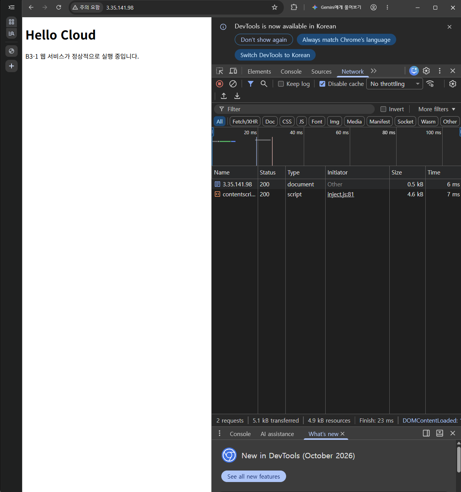

# B3-1 AWS Cloud Infrastructure

AWS에 VPC·퍼블릭 서브넷·Internet Gateway·Security Group·EC2를 구성하고, Nginx로 **Hello Cloud** 웹페이지를 제공하는 클라우드 인프라 실습입니다.

외부 접속 검증은 **A 방식 — 브라우저 HTTP 접속**을 사용합니다.

## 1. 프로젝트 목표

- VPC와 서브넷, 라우팅을 구성하여 EC2의 인터넷 통신 환경을 만든다.
- IAM 사용자로 AWS 리소스를 관리하고, Security Group으로 HTTP·SSH 접근을 제어한다.
- SSH로 EC2에 접속하여 Nginx를 설치하고 웹페이지를 배포한다.
- 서버 내부와 외부의 HTTP 응답을 검증하고, 통신 장애 분석과 리소스 정리 결과를 남긴다.

## 2. 실습 환경

| 항목 | 내용 |
|---|---|
| AWS 리전 | 아시아 태평양 서울 · `ap-northeast-2` |
| EC2 | `b3-1-web` · `t3.micro` |
| 서버 운영체제 | Ubuntu 26.04 LTS |
| 웹 서버 | Nginx 1.28.3 |
| 작업 환경 | Mac · Windows · Git Bash · Google Chrome |
| 실습 IAM 사용자 | `b3-1-student` |
| 웹 문서 경로 | `/var/www/html/index.html` |
| 검증 기록일 | 2026-09-29 |

운영체제와 Nginx 버전은 [서버 확인 출력](docs/evidence/02-server-check.txt)을 기준으로 기록했습니다.

## 3. 인프라 구성

| 구성 요소 | 실습 구성 |
|---|---|
| VPC | `b3-1-vpc` · `10.0.0.0/16` |
| 퍼블릭 서브넷 | `b3-1-public-subnet` · `10.0.1.0/24` |
| Internet Gateway | `b3-1-igw` · 실습 VPC에 연결 |
| Route Table | `b3-1-public-rt` · 서브넷에 적용, 기본 경로 `0.0.0.0/0`의 대상은 IGW |
| Security Group | `b3-1-web-sg` · EC2에 연결 |
| HTTP 인바운드 | TCP 80 · `0.0.0.0/0` |
| SSH 인바운드 | TCP 22 · 허용한 접속지의 공인 IPv4 `/32` |

외부 HTTP 요청은 IGW를 거쳐 EC2에 도달하고, SG가 허용한 요청을 Nginx가 처리합니다. IAM은 AWS 리소스 작업 권한을, SG는 네트워크 통신을 제어합니다.

📍 [인프라 구성도 보기](docs/architecture.png) · [구성도 편집 원본](docs/architecture.drawio)

## 4. 외부 접속 증빙

- **접속 방식:** A — 브라우저 HTTP 접속
- **검증 당시 URL:** http://3.35.141.98/
- **검증 당시 퍼블릭 IPv4:** `3.35.141.98`
- **검증 환경:** Windows / Google Chrome
- **확인 결과:** `Hello Cloud` 페이지 표시 및 Network의 document 요청 `200 OK`




## 5. 배포 및 확인 방법

**Windows Git Bash — 프로젝트 최상위 폴더**에서 실행합니다. `PUBLIC_IP`는 현재 EC2 콘솔의 주소에 맞춥니다.

```bash
PUBLIC_IP="3.35.141.98"
KEY_PATH="$HOME/Desktop/All/Codyssey/b3-1-key.pem"

mkdir -p ../ssh

scp -o "UserKnownHostsFile=../ssh/known_hosts" \
  -i "$KEY_PATH" web/index.html \
  "ubuntu@$PUBLIC_IP:b3-1-index.html"

ssh -o "UserKnownHostsFile=../ssh/known_hosts" \
  -i "$KEY_PATH" "ubuntu@$PUBLIC_IP"
```

**SSH로 접속한 EC2 내부**에서 실행합니다.

```bash
sudo apt update
sudo apt install -y nginx
sudo systemctl enable --now nginx
sudo install -m 644 ~/b3-1-index.html /var/www/html/index.html

sudo nginx -t
curl -i http://localhost
```

브라우저에서는 `http://현재_EC2_퍼블릭_IP/`로 접속합니다. 이 실습의 외부 접속 검증은 HTTP 80번 포트를 사용합니다.

## 6. 확인된 검증 결과

아래 결과는 2026-09-29에 저장한 실행 기록을 기준으로 합니다.

| 검증 | 확인 결과 | 원본 기록 |
|---|---|---|
| EC2 인터넷 아웃바운드 | `https://example.com` 요청에 HTTP 200 응답 | [01-outbound.txt](docs/evidence/01-outbound.txt) |
| 서버 상태·내부 HTTP | `ubuntu` 접속, Nginx `active`·`enabled`, 설정 검사 성공, localhost HTTP 200 및 `Hello Cloud` | [02-server-check.txt](docs/evidence/02-server-check.txt) |
| 외부 HTTP | Windows에서 HTTP 200 및 `Hello Cloud` 확인 | [03-external-http.txt](docs/evidence/03-external-http.txt) |

장애 재현·복구의 분석은 트러블슈팅 보고서에, 리소스 정리 결과는 정리 체크리스트에 기록합니다.

## 7. 제출 자료

| 자료 | 파일 |
|---|---|
| 인프라 구성도 | [docs/architecture.png](docs/architecture.png) |
| 외부 접속 방식·URL/IP·스크린샷 | 이 README의 **외부 접속 증빙** |
| 트러블슈팅 보고서 | [docs/troubleshooting.md](docs/troubleshooting.md) |
| 리소스 정리 체크리스트 | [docs/cleanup-checklist.md](docs/cleanup-checklist.md) |
| 검증 출력·스크린샷 | [docs/evidence/](docs/evidence/) |
| 배포한 HTML | [web/index.html](web/index.html) |

### 진행 상태

- [x] Nginx 배포 및 서버 내부·외부 HTTP 검증
- [x] A 방식 브라우저 접속 증빙 확보
- [x] 장애 재현·복구 수행 및 트러블슈팅 보고서 작성 완료
- [x] AWS 리소스 정리 및 정리 체크리스트 작성 완료

개인 키(`.pem`), AWS 자격증명, 비밀번호, GitHub 토큰은 저장소에 포함하지 않습니다.

> 서비스 상태: 실습 완료 후 EC2를 종료하여 현재 접속할 수 없습니다. 위 URL과 IP는 검증 당시 주소입니다.
