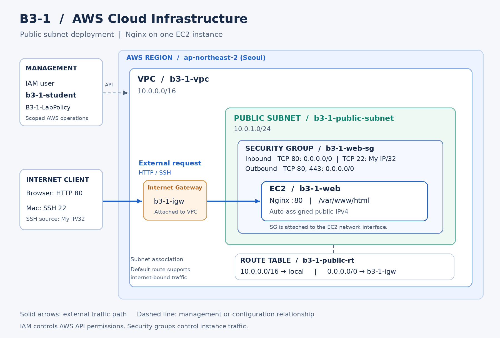

# B3-1 AWS Cloud Infrastructure

AWS에서 VPC, Public Subnet, Internet Gateway, Security Group, EC2를 구성하고 Nginx 웹 서비스를 배포하는 실습입니다. 외부 접속 검증은 **A 방식: 브라우저 접속**을 사용합니다.

> 제출 작성 틀입니다. 아래 구성값은 이전 가이드 기준이므로 실제 AWS 콘솔과 대조해 수정하세요. 결과 입력란과 체크박스는 직접 검증한 뒤 작성하고, 제출 전에 이 안내문을 지우세요.

## 1. 실습 정보

| 항목 | 실제 내용 |
|---|---|
| 저장소 | https://github.com/dave17code/b3-1-aws-cloud-infra |
| 리전 | 서울, `ap-northeast-2` |
| 검증 일시 | 2026.09.28~ |
| EC2 이름 / 인스턴스 유형 | `b3-1-web` / t3.micro |
| 운영체제 | [작성 필요: 서버에서 확인한 OS와 버전] |
| 루트 EBS | [작성 필요: 유형·용량·Delete on termination] |
| 무료 혜택 적용 확인 | [작성 필요: 확인일과 적용되는 플랜·크레딧/무료 사용량] |
| 실습 IAM 사용자 | `b3-1-student` |
| IAM 권한 확인 | [작성 필요: 연결 정책, 다른 정책·그룹의 관리자 권한 여부] |
| 제출 시 서비스 상태 | [작성 필요: 실행 중 또는 실습 종료 후 리소스 정리 완료] |

## 2. 인프라 구성



구성도 대조 결과: [작성 필요: 실제 콘솔 설정과 일치 여부·확인일]

| 구성 요소 | 설정 |
|---|---|
| VPC | `b3-1-vpc`, `10.0.0.0/16` |
| Public Subnet | `b3-1-public-subnet`, `10.0.1.0/24` |
| Internet Gateway | `b3-1-igw`, 위 VPC에 연결 |
| Route Table | `b3-1-public-rt`, 위 Subnet에 연결 |
| 내부 경로 | `10.0.0.0/16 → local` |
| 인터넷 경로 | `0.0.0.0/0 → b3-1-igw` |
| EC2 퍼블릭 IPv4 | 자동 할당 |
| SG | `b3-1-web-sg` |
| 인바운드 HTTP | TCP 80, `0.0.0.0/0` |
| 인바운드 SSH | TCP 22, 본인 현재 공인 IPv4의 `/32` |
| 아웃바운드 | TCP 80·443, `0.0.0.0/0` |
| VPC DNS | Amazon 제공 DNS, DNS resolution 활성화 |

외부 요청은 인터넷과 IGW를 통해 EC2의 네트워크 인터페이스에 도달하며, SG가 허용한 요청을 Nginx가 처리합니다. Subnet에 연결된 Route Table의 기본 경로는 인터넷 방향 통신에 사용됩니다. SG는 EC2에 연결되는 방화벽 규칙이며 별도의 프록시 서버가 아닙니다.

IAM은 AWS 리소스 작업 권한을, SG는 네트워크 통신을 제어합니다. `B3-1-LabPolicy`를 사용했다면 서비스·작업·서울 리전 수준으로 제한한 실습 정책입니다. `Resource: "*"`인 정책을 개별 실습 리소스까지 제한한 최종 최소권한 정책으로 설명하지 않습니다.

## 3. 배포 방법

로컬 `web/index.html`을 SSH 키로 EC2에 전송한 뒤, Ubuntu에서 아래 순서로 배포했습니다. 실제 실행한 명령과 다르다면 수정하세요.

```bash
sudo apt update
sudo apt install -y nginx
sudo systemctl enable --now nginx
sudo install -m 644 ~/b3-1-index.html /var/www/html/index.html
sudo nginx -t
curl -i http://localhost
```

## 4. 필수 검증 결과

| 검증 항목 | 실제 결과 | 근거 |
|---|---|---|
| VPC·Subnet·IGW·Route Table | [작성 필요] | 콘솔 대조 및 위 구성도 |
| EC2 1대·상태 검사 | [작성 필요] | EC2 콘솔 |
| 키페어 SSH 접속 | [작성 필요] | `02-server-check.txt`의 사용자·OS 출력 |
| EC2 인터넷 아웃바운드 | [작성 필요] | [01-outbound.txt](docs/evidence/01-outbound.txt) |
| Nginx 실행·설정 검사 | [작성 필요] | [02-server-check.txt](docs/evidence/02-server-check.txt) |
| localhost HTTP 200 | [작성 필요] | [02-server-check.txt](docs/evidence/02-server-check.txt) |
| 외부 HTTP 200 | [작성 필요] | [03-external-http.txt](docs/evidence/03-external-http.txt) |
| A 방식 브라우저 접속 | [작성 필요] | 아래 실제 스크린샷 |
| HTTP 공개·SSH IP 제한 | [작성 필요] | SG 콘솔 및 [복구한 규칙](docs/evidence/10-sg-restored.png) |
| IAM 제한·루트 계정 미사용 | [작성 필요] | 위 IAM 확인 기록 |
| 장애 재현·원인 검증·복구 | [작성 필요] | [트러블슈팅 보고서](docs/troubleshooting.md) |

### 외부 접속 증빙

- 검증 방식: **A — 브라우저로 HTTP 접속**
- 검증 당시 URL: [작성 필요: http://실제퍼블릭IPv4/]
- 검증 당시 퍼블릭 IPv4: [작성 필요]
- 검증 일시와 시간대: [작성 필요]
- 실제 브라우저 결과 / HTTP 상태: [작성 필요]
- 현재 접속 가능 여부: [작성 필요: 종료 후에는 검증 당시 주소이며 현재 접속 불가라고 명시]


## 5. 제출물

| 필수 제출물 | 파일 |
|---|---|
| VPC·Subnet·IGW·EC2·SG와 외부 요청 흐름이 있는 구성도 | [docs/architecture.png](docs/architecture.png) |
| A/B 방식·URL/IP·실제 외부 접속 스크린샷 | 이 README의 외부 접속 증빙 |
| 증상·가설·검증·조치·결과·재발 방지 | [docs/troubleshooting.md](docs/troubleshooting.md) |
| 실습 리소스 정리 결과 | [docs/cleanup-checklist.md](docs/cleanup-checklist.md) |

`web/index.html`, `docs/architecture.drawio`, 증빙 텍스트 파일은 재현과 작성을 돕는 보조 파일입니다. `.pem`, AWS 자격증명, 비밀번호, GitHub 토큰은 저장소에 포함하지 않습니다.

## 6. 최종 확인

- [ ] 실제 구성과 구성도가 일치한다.
- [ ] README에 실제 검증 URL/IP, 방식, 시각, 브라우저 스크린샷이 있다.
- [ ] localhost 200과 외부 200을 각각 확인했다.
- [ ] 트러블슈팅 여섯 항목에 실제 출력과 복구 결과를 기록했다.
- [ ] 정리 체크리스트를 실제 확인 결과로 작성했다.
- [ ] 남겨야 하는 정당한 확인 대기를 제외하고 입력란을 모두 채웠다.
- [ ] GitHub에서 모든 파일과 이미지가 열리고 비밀 정보가 없다.
