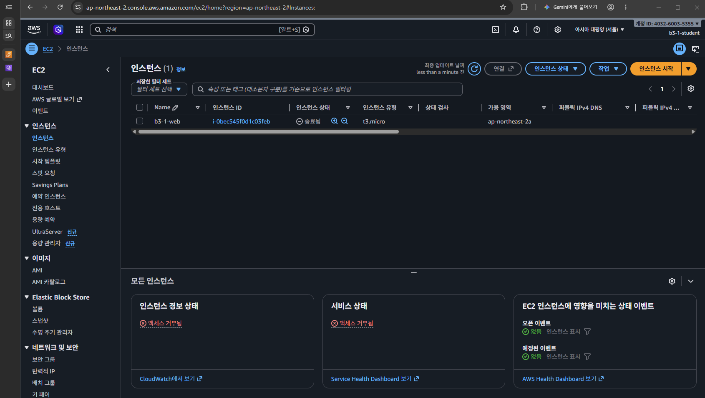
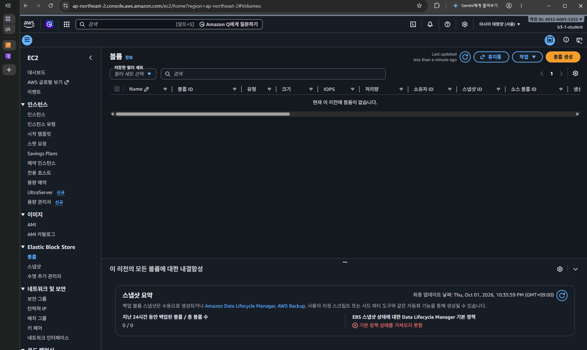

# 실습 리소스 정리 체크리스트

리전: 서울 ap-northeast-2

## 대상 리소스

| 항목 | 실제 리소스 ID |
|---|---|
| EC2 b3-1-web | i-0bec545f0d1c03feb |
| EBS | vol-097a3489f60b90307 |
| Elastic IP | 없음 |
| SG b3-1-web-sg | sg-0af56863dc57ab34d |
| Subnet b3-1-public-subnet | subnet-075f9e3592f305a05 |
| Route Table b3-1-public-rt | rtb-0fc0e51150acf90f3 |
| IGW b3-1-igw | igw-0c88f4eb2938ca99d |
| VPC b3-1-vpc | vpc-054bab9bd17c0efed |

## 정리 결과

확인 기록 시각: 2026-10-01T22:40:58+0900

아래 결과는 AWS 콘솔에서 대상 ID와 상태를 직접 확인하여 기록했다.

| 항목 | 수행 작업 및 확인 결과 |
|---|---|
| EC2 b3-1-web | 인스턴스를 종료하고 terminated 상태를 확인했다. |
| EBS | 기록한 볼륨 ID의 조회 결과가 없으며, 미사용 실습용 볼륨도 남아 있지 않음을 확인했다. |
| Elastic IP | 이번 실습용 Elastic IP 할당이 남아 있지 않음을 확인했다. |
| SG b3-1-web-sg | VPC 삭제 후 기록한 보안 그룹 ID가 없음을 확인했다. |
| Subnet b3-1-public-subnet | VPC 삭제 후 기록한 서브넷 ID가 없음을 확인했다. |
| Route Table b3-1-public-rt | VPC 삭제 후 기록한 라우팅 테이블 ID가 없음을 확인했다. |
| IGW b3-1-igw | VPC 삭제 후 기록한 인터넷 게이트웨이 ID가 없음을 확인했다. |
| VPC b3-1-vpc | VPC 삭제 후 기록한 VPC ID가 없음을 확인했다. |
| AWS 키페어 b3-1-key | 키페어를 삭제하고 목록에서 사라졌음을 확인했다. |

미완료 항목: 없음.

IAM 사용자 b3-1-student와 정책 B3-1-LabPolicy는 유지한다.
IAM 사용자·정책 삭제는 이 미션의 필수 리소스 정리 항목에 포함되지 않는다.

## 정리 증빙

